# vite-extension

## Features

- [x] Mnemonic creation, input, output and encryption
- [x] Address switch
- [x] The ability to add new tokens and check balance
- [x] List of pending transactions and unreceived transactions
- [x] The ability to send transactions and receive transactions
- [ ] The Hook for signing and sending transactions
- [x] The ability to switch networks (Mainnet, testnet,etc.)

## Demo

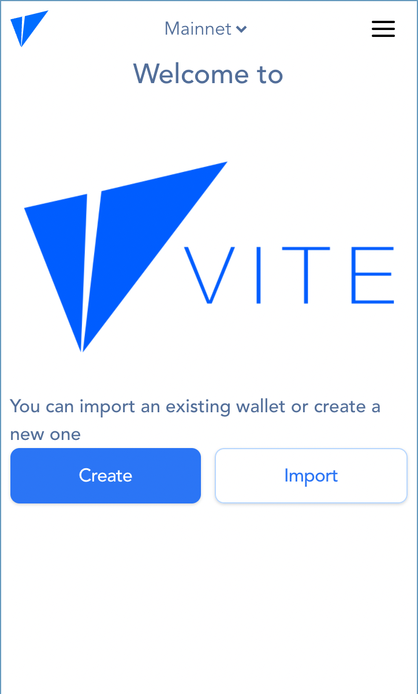
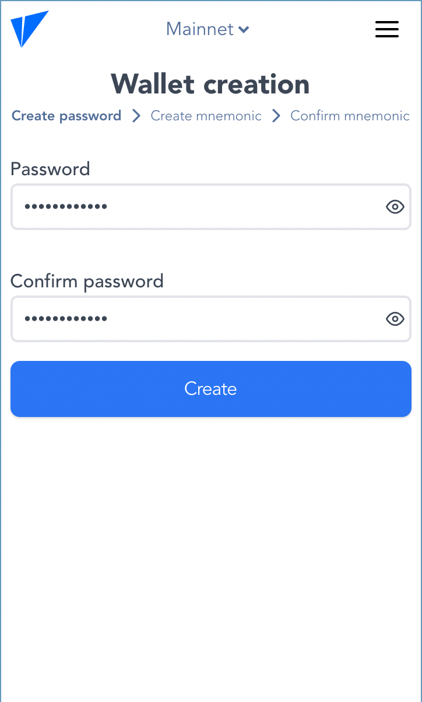
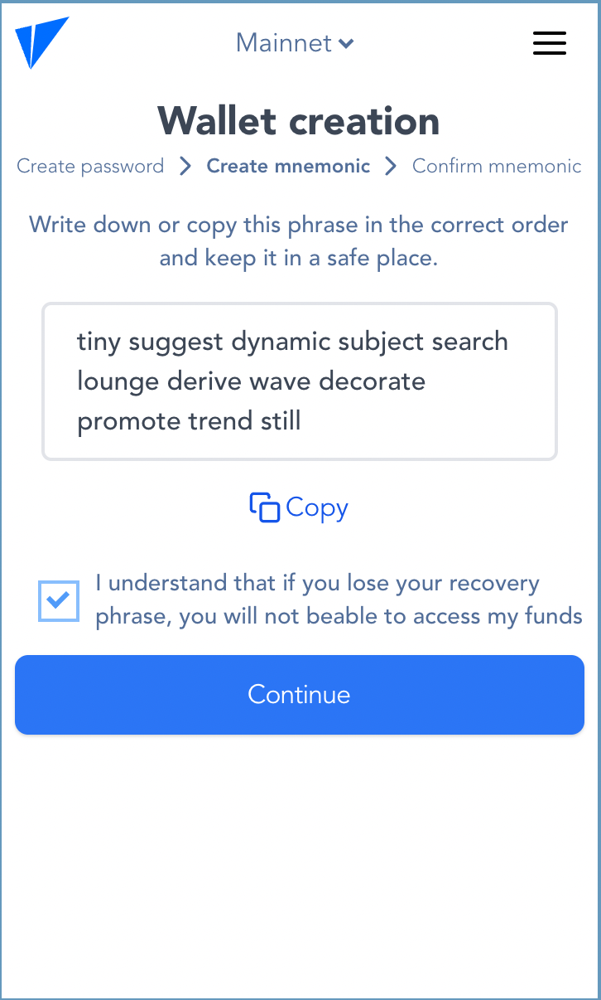
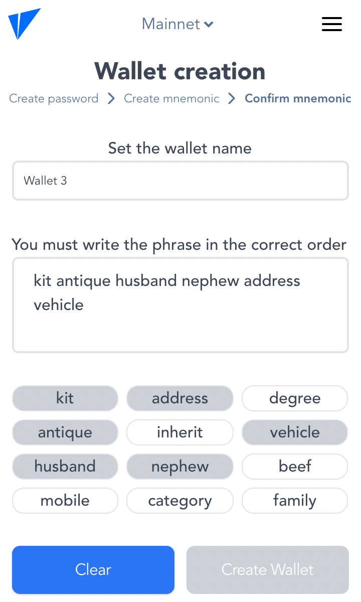
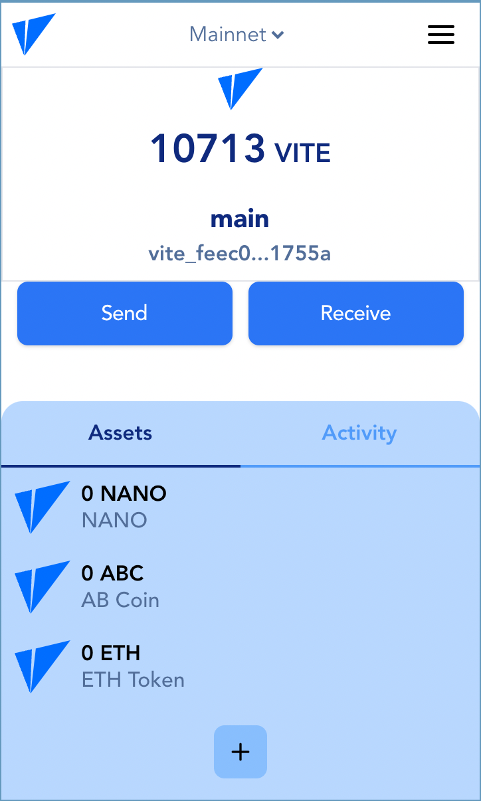
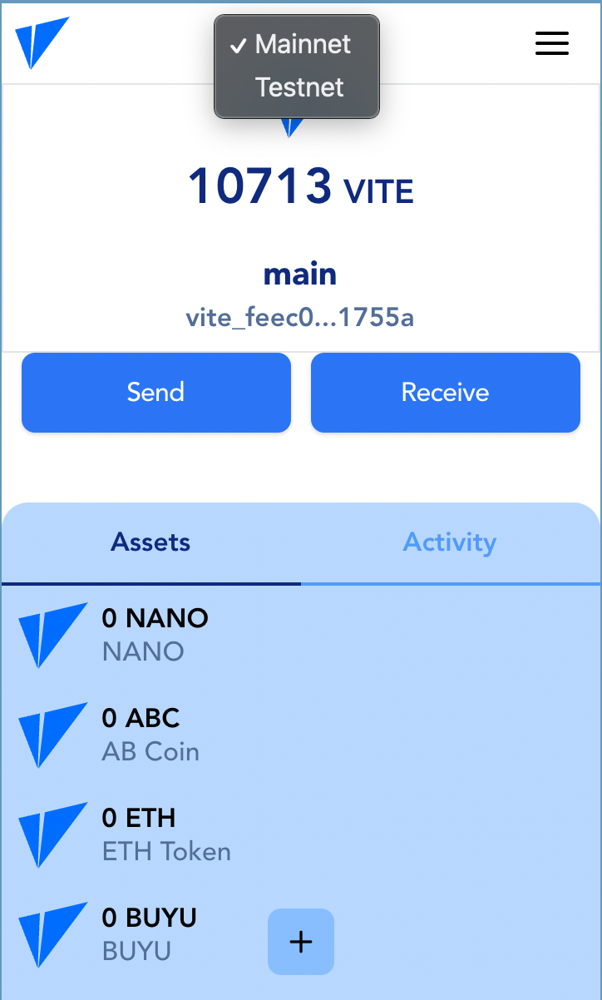
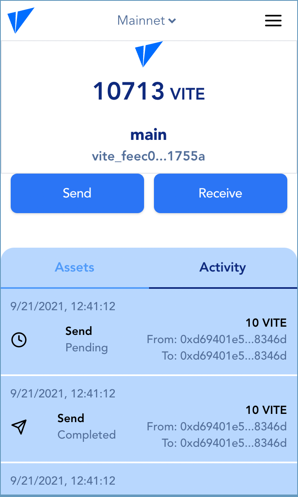
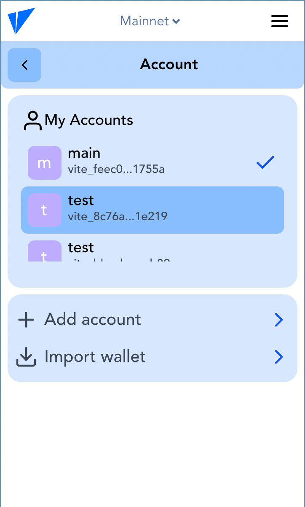
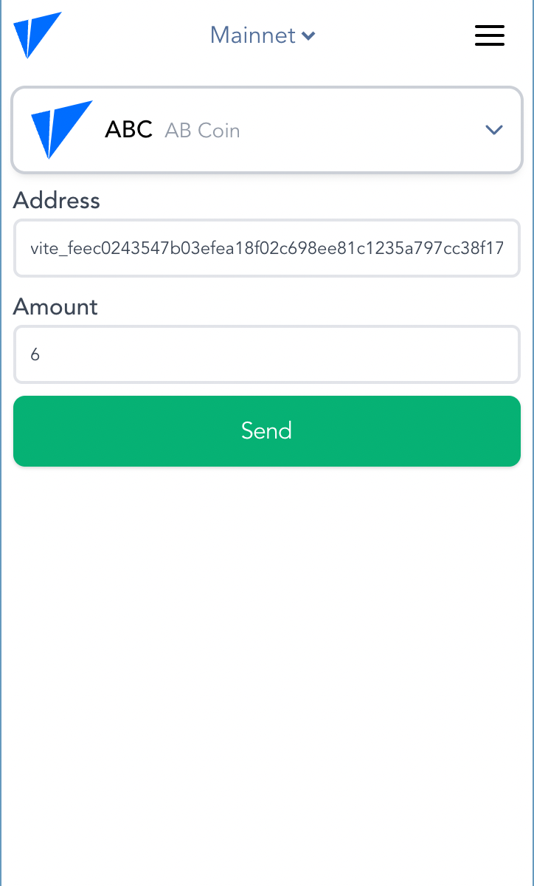
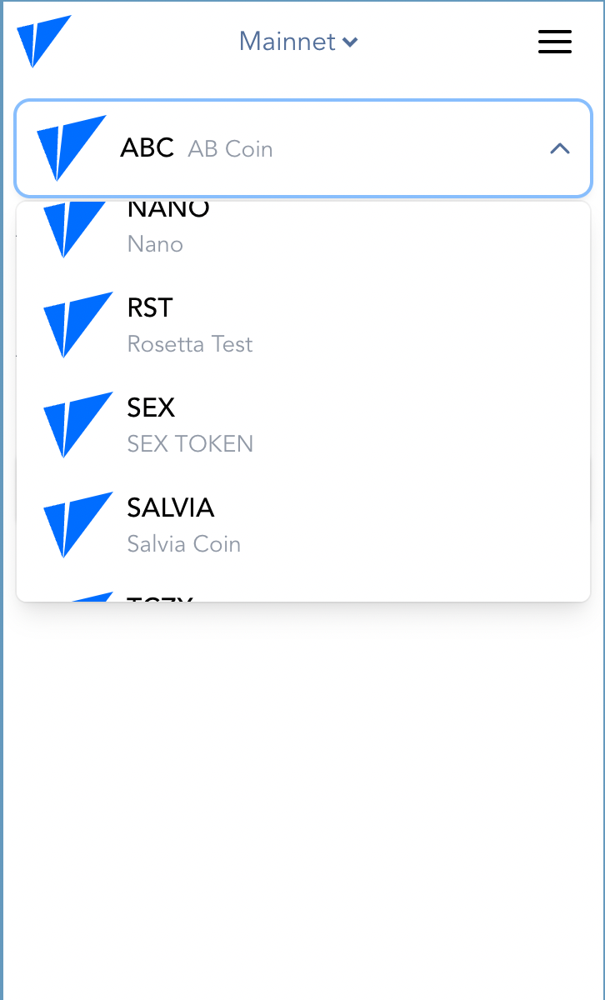
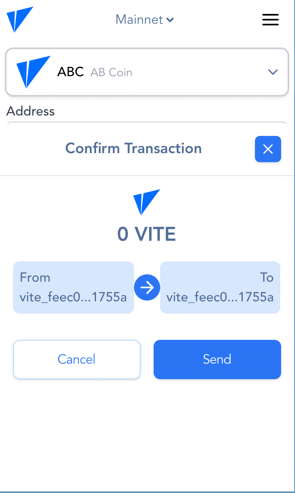

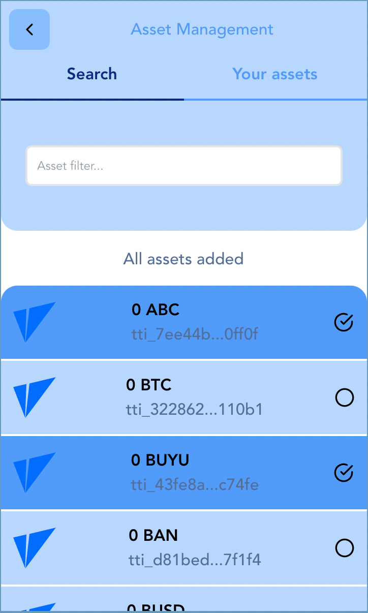
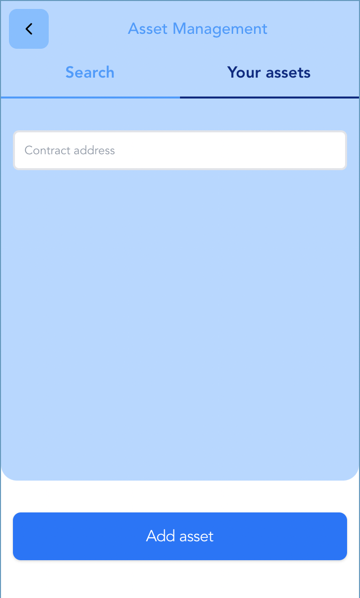

## Project setup

```
yarn install
```

## Development

Script `dev:app` runs app like regular Vue app on page, with access to the vue-devtools.

Script `dev:extension` runs app in watch mode via webpack and have full access to the Chrome Extension API during the development.

Upload pre-bilded extension from dist folder to the `chrome://extensions/` and create your dev link using extension ID.

Link example — `chrome-extension://{your_extension_id}/index.html#/`

### Compiles and hot-reloads for development

```
yarn serve
```

### Compiles and minifies for production

```
yarn build
```

### Run your unit tests

```
yarn test:unit
```

### Run your end-to-end tests

```
yarn test:e2e
```

### Lints and fixes files

```
yarn lint
```

### Customize configuration

See [Configuration Reference](https://cli.vuejs.org/config/).
